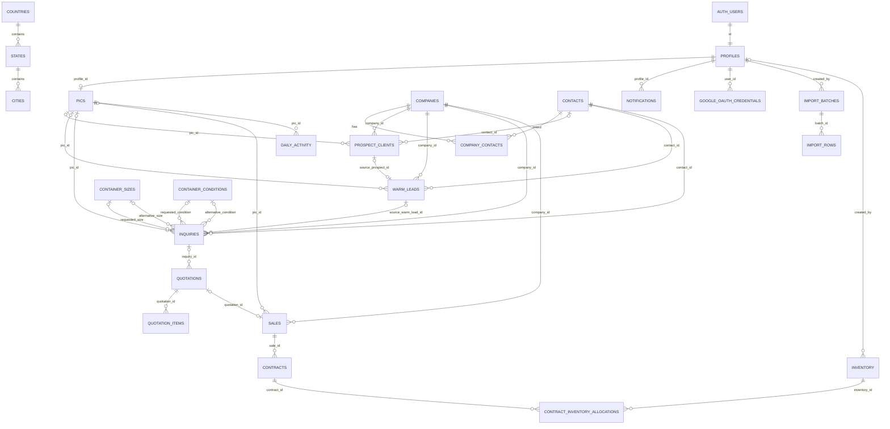

# Container CRM — End-to-End System Flow

```mermaid
flowchart LR
    P["Prospect\nSales Manager / Admin"] -->|"convert eligible Proceed record"| W["Warm Lead\nSales Manager / Admin"]
    W -->|"create inquiry\n(warm lead normally remains active)"| I["Inquiry: Pending Validation\nSales-owned ticket"]
    M["Manual inquiry\nSales Manager / Admin"] --> I
    I -->|"cross-silo handoff + notification"| V{"Procurement validation\nProcurement / Admin"}
    V -->|"approve"| U["Inquiry: Under Review\nquotable"]
    V -->|"reject + reason"| R["Validation Rejected"]
    R -->|"structured alternative supplied\nowner applies it"| U
    R -->|"no structured alternative"| X["Blocked from quotation"]
    U -->|"create quotation"| Q["Quotation: Draft\nSales Manager / Admin"]
    Q -->|"Sent / Viewed / Accepted"| A["Quotation: Accepted"]
    Q -->|"Rejected or removed"| QR["Inquiry: Quotation Rejected\nmay be re-quoted"]
    QR --> Q
    A -->|"record units, cost, revenue"| S["Sale: Won\nQuotation: Converted\nInquiry: Converted to Sale"]
    MS["Manual sale\nSales Manager / Admin"] --> S
    S --> C["Customer account projection\nActive or Floating"]
    S -->|"reserve selected inventory + generate contract"| K["Contract: Pending Signature\nAdmin / Operations: any sale\nSales Manager: own sale"]
    K --> PU["Pickup status on contract\nPending → Scheduled → Confirmed → Picked Up\nOverdue is derived from date"]
    PU -->|"fulfil allocation"| ST["Inventory available and reserved quantities decremented"]
```

The browser calls `/api/v1` with the current Supabase access token; Express authenticates the token, loads the profile and active PIC, then uses a service-role Supabase client for business queries. Consequently, the explicit controller/service filters are the effective authorization boundary for API traffic, even where equivalent RLS exists. (`frontend/src/lib/api.ts:4`, `frontend/src/lib/api.ts:9`, `backend/src/index.ts:43`, `backend/src/index.ts:46`, `backend/src/middleware/auth.middleware.ts:25`, `backend/src/config/supabase.ts:4`)

Socket.IO shares the Express HTTP server. Its handshake independently verifies the Supabase token and active profile; successful API mutations publish payload-free `crm:changed` invalidations. React hooks then re-fetch through the same authorized HTTP endpoints, preserving PIC and role filtering. (`backend/src/realtime.ts:17`, `backend/src/realtime.ts:23`, `backend/src/realtime.ts:58`, `frontend/src/lib/realtime.ts:46`, `frontend/src/lib/realtime.ts:68`)

## 1. Runtime and ownership model

- `/api/health` is public. Auth helper routes are mounted separately; every other router is behind `requireAuth`. (`backend/src/index.ts:39`, `backend/src/index.ts:44`, `backend/src/index.ts:46`)
- Authentication requires a bearer token, an existing active profile, and one of `admin`, `sales_manager`, `procurement`, or `operations`. An active PIC is loaded when one exists. (`backend/src/middleware/auth.middleware.ts:18`, `backend/src/middleware/auth.middleware.ts:30`, `backend/src/middleware/auth.middleware.ts:40`, `backend/src/middleware/auth.middleware.ts:44`, `backend/src/middleware/auth.middleware.ts:49`)
- Signup creates both the profile and an active PIC; a partial unique index permits at most one active PIC per profile. New profiles default to `sales_manager` after migration 021; migration 031 expands the allowed roles to all four current roles. (`supabase/migrations/20260828143200_025_auto_pic_creation.sql:26`, `supabase/migrations/20260828143200_025_auto_pic_creation.sql:45`, `supabase/migrations/20260901000000_028_unique_active_pic_per_profile.sql:15`, `supabase/migrations/20260827220500_021_update_roles.sql:12`, `supabase/migrations/20260902010000_031_inquiry_ticketing_and_notifications.sql:12`)
- The pipeline ownership key is `pic_id`, copied forward Prospect → Warm Lead → Inquiry → Quotation → Sale. Lead and quotation working lists filter every role, including admin, to its active PIC; the sales list is organization-wide for admin/operations because it feeds contract creation, and own-PIC for sales managers. Users without a PIC receive empty own-PIC lists; manual pipeline creation is refused. (`backend/src/controllers/lead.controller.ts:54`, `backend/src/controllers/deal.controller.ts:25`, `backend/src/controllers/deal.controller.ts:46`, `backend/src/controllers/lead.controller.ts:23`)
- Database-side `user_has_pipeline_access(pic_id)` is strict PIC equality with no admin bypass. It is attached to prospects, warm leads, inquiries, quotations, and sales; contracts refer through the owning sale. (`supabase/migrations/20260827231000_022_strict_silos.sql:4`, `supabase/migrations/20260827202000_020_rls_data_silos.sql:271`, `supabase/migrations/20260827202000_020_rls_data_silos.sql:291`, `supabase/migrations/20260828004500_024_contracts_module.sql:48`)
- Important boundary: migration 007 revoked browser access to operational tables, and the Express backend uses the Supabase secret/service key. RLS therefore protects direct authenticated-client access, but it does **not** compensate for a missing ownership check in an API handler. (`supabase/migrations/20260826010000_007_security_foundation.sql:74`, `supabase/migrations/20260826010000_007_security_foundation.sql:102`, `backend/src/config/supabase.ts:4`)

## 2. Pipeline stage reference

“Enforced” means a database check or API enum prevents other values. “Observed” means the column is unconstrained `TEXT`; other strings are technically database-valid, but these are the values produced or understood by current code.

| Stage | Creation and progression | Acting role(s) | API and table(s) | Status values | Progression blockers / invariants |
|---|---|---|---|---|---|
| Prospect | Created manually or by prospect import. `Proceed` + active converts transactionally to one Warm Lead; the prospect becomes `converted` and stores optional reason/channel. (`backend/src/routes/lead.routes.ts:27`, `backend/src/routes/import.routes.ts:7`, `supabase/migrations/20260826024000_016_manual_warm_leads_and_inquiries.sql:244`) | Create/import/convert: admin or sales manager. (`backend/src/routes/lead.routes.ts:21`, `backend/src/routes/lead.routes.ts:27`, `backend/src/routes/import.routes.ts:7`) | `POST /leads/prospects`; `POST /data/imports`; `POST /leads/prospects/:id/convert-to-warm-lead`; `prospect_clients`, plus shared `companies`, optional `contacts`, and `company_contacts`. | `lifecycle_status` is enforced: `active`, `converted`, `removed`, `inactive`. Business `category` accepted by manual API: `Proceed`, `Removed`. (`supabase/migrations/20260826012000_009_lifecycle_and_imports.sql:121`, `backend/src/schemas/lead.schema.ts:64`) | Conversion requires existing record, `active`, category `Proceed`, and no company/contact/email/phone suppression match. Existing source Warm Lead makes conversion idempotently return it. (`supabase/migrations/20260826024000_016_manual_warm_leads_and_inquiries.sql:260`, `supabase/migrations/20260826024000_016_manual_warm_leads_and_inquiries.sql:263`, `supabase/migrations/20260826024000_016_manual_warm_leads_and_inquiries.sql:266`, `supabase/migrations/20260826024000_016_manual_warm_leads_and_inquiries.sql:270`) |
| Warm Lead | Created from a Prospect or manually. A linked creation through `/warm-leads/:id/create-inquiry` creates an Inquiry while deliberately leaving the Warm Lead active, so it can generate multiple inquiries. (`backend/src/routes/lead.routes.ts:24`, `backend/src/routes/lead.routes.ts:28`, `supabase/migrations/20260902010000_031_inquiry_ticketing_and_notifications.sql:138`) | Admin or sales manager. (`backend/src/routes/lead.routes.ts:24`, `backend/src/routes/lead.routes.ts:28`) | `POST /leads/warm-leads`; `POST /leads/warm-leads/:id/create-inquiry`; `warm_leads`. | Enforced: `active`, `converted`, `removed`, `closed`. (`supabase/migrations/20260826012000_009_lifecycle_and_imports.sql:124`) | Manual creation requires company and, at the SQL layer, a contact person/email/phone sufficient to produce a contact; suppression blocks it. Inquiry creation requires active Warm Lead, valid catalog size/condition, quantity ≥1, and no suppression match. (`backend/src/schemas/lead.schema.ts:24`, `supabase/migrations/20260827012000_019_fallback_contact_name.sql:117`, `supabase/migrations/20260827012000_019_fallback_contact_name.sql:121`, `supabase/migrations/20260902010000_031_inquiry_ticketing_and_notifications.sql:103`, `supabase/migrations/20260902010000_031_inquiry_ticketing_and_notifications.sql:111`) |
| Inquiry | Created from a Warm Lead or manually against a Warm Lead/company. It starts `Pending Validation`, then Procurement approves to `Under Review` or rejects to `Validation Rejected`. Only `Under Review` and `Quotation Rejected` are offered for quotation in the UI. (`backend/src/routes/lead.routes.ts:24`, `backend/src/routes/lead.routes.ts:29`, `supabase/migrations/20260902010000_031_inquiry_ticketing_and_notifications.sql:134`, `frontend/src/App.tsx:2215`) | Create/apply alternative/quote: admin or sales manager. Validate: admin or procurement. (`backend/src/routes/lead.routes.ts:17`, `backend/src/routes/lead.routes.ts:18`, `backend/src/routes/deal.routes.ts:9`) | `POST /leads/inquiries`; `POST /leads/inquiries/:id/validate`; `POST /leads/inquiries/:id/apply-alternative`; `POST /deals/quotations`; `inquiries`. | Check-constrained: `Pending Validation`, `Under Review`, `Validation Rejected`, `Quotation Created`, `Quotation Rejected`, `Converted to Sale`, `Removed`, `Lost`. `Lost` is recognized by guards/reports but no current write path sets it. (`supabase/migrations/20260903050000_037_guarded_fulfillment.sql:5`, `supabase/migrations/20260903030000_035_monthly_report.sql:161`) | Creation requires catalog size/condition and quantity ≥1; standalone manual inquiry requires a company, while linked manual inquiry requires only Warm Lead ID. Quotation SQL blocks `Pending Validation`, `Validation Rejected`, `Removed`, `Lost`, and `Converted to Sale`; it also requires at least one valid item. (`backend/src/schemas/lead.schema.ts:39`, `supabase/migrations/20260902010000_031_inquiry_ticketing_and_notifications.sql:184`, `supabase/migrations/20260902010000_031_inquiry_ticketing_and_notifications.sql:349`, `supabase/migrations/20260902010000_031_inquiry_ticketing_and_notifications.sql:353`) |
| Validation | Not a separate record: it mutates the Inquiry and stamps `validated_by`, `validated_at`, reason, and optional structured alternative fields. (`supabase/migrations/20260902010000_031_inquiry_ticketing_and_notifications.sql:47`, `supabase/migrations/20260903000000_032_structured_inquiry_alternative.sql:72`) | Admin or procurement; queue/board is intentionally organization-wide. (`backend/src/routes/lead.routes.ts:11`, `backend/src/controllers/lead.controller.ts:292`) | `GET /leads/inquiries/pending-validation`; `GET /leads/inquiries/board`; `POST /leads/inquiries/:id/validate`; `inquiries`, `notifications`, `domain_events`. | Same Inquiry values; transition is exactly `Pending Validation` → `Under Review` or `Validation Rejected`. (`supabase/migrations/20260903000000_032_structured_inquiry_alternative.sql:50`, `supabase/migrations/20260903000000_032_structured_inquiry_alternative.sql:73`) | Only pending tickets validate. Rejection requires a nonblank reason; alternative catalog IDs must exist. API additionally requires reason length 3–1000, quantity ≥1, price ≥0. (`supabase/migrations/20260903000000_032_structured_inquiry_alternative.sql:50`, `supabase/migrations/20260903000000_032_structured_inquiry_alternative.sql:53`, `supabase/migrations/20260903000000_032_structured_inquiry_alternative.sql:56`, `backend/src/schemas/lead.schema.ts:110`) |
| Quotation | Created from an eligible Inquiry with item lines; inquiry becomes `Quotation Created`. Status follows Draft → Sent → Viewed → Accepted/Rejected (Draft may be directly accepted/rejected); only accepted quotes convert to Sale. (`supabase/migrations/20260902010000_031_inquiry_ticketing_and_notifications.sql:368`, `supabase/migrations/20260903050000_037_guarded_fulfillment.sql:63`, `supabase/migrations/20260826013000_010_deal_transactions.sql:128`) | Admin or sales manager. (`backend/src/routes/deal.routes.ts:9`) | `POST /deals/quotations`; `PATCH /deals/quotations/:id/status`; `POST /deals/quotations/:id/convert-to-sale`; `quotations`, `quotation_items`, source `inquiries`. | Check-constrained: `Draft`, `Sent`, `Viewed`, `Accepted`, `Rejected`, `Converted`; only Sale conversion writes `Converted`. (`supabase/migrations/20260903050000_037_guarded_fulfillment.sql:10`, `backend/src/schemas/deal.schema.ts:14`) | One non-rejected quote per inquiry; an existing active quote is returned idempotently. Items require description, quantity ≥1, unit price ≥0. Rejected and Converted quotations are terminal. Sale conversion requires Accepted and is one sale per quotation. (`supabase/migrations/20260826020000_012_quotation_requote_and_status_guard.sql:13`, `supabase/migrations/20260902010000_031_inquiry_ticketing_and_notifications.sql:361`, `supabase/migrations/20260903050000_037_guarded_fulfillment.sql:75`, `supabase/migrations/20260826013000_010_deal_transactions.sql:7`) |
| Sale | Created from Accepted Quotation or directly as a manual sale. Quotation conversion atomically writes Sale `Won`, Quotation `Converted`, Inquiry `Converted to Sale`, and gross profit = revenue − buying cost. (`backend/src/routes/deal.routes.ts:11`, `backend/src/routes/deal.routes.ts:15`, `supabase/migrations/20260826013000_010_deal_transactions.sql:135`) | Admin or sales manager. (`backend/src/routes/deal.routes.ts:11`, `backend/src/routes/deal.routes.ts:15`) | `POST /deals/quotations/:id/convert-to-sale`; `POST /deals/sales`; `sales`. | Check-constrained: `Pending`, `Won`. Both current creation functions write `Won`; there is no sale-status update endpoint. (`supabase/migrations/20260903050000_037_guarded_fulfillment.sql:12`, `supabase/migrations/20260826013000_010_deal_transactions.sql:141`, `backend/src/routes/deal.routes.ts:14`) | Units ≥1, cost/revenue ≥0; quotation path requires Accepted and is idempotent under the unique quotation index. Manual sale requires company and is blocked by suppression. (`backend/src/schemas/deal.schema.ts:18`, `supabase/migrations/20260826013000_010_deal_transactions.sql:119`, `supabase/migrations/20260827010000_017_manual_prospect_sale_and_flow_fixes.sql:195`, `supabase/migrations/20260827010000_017_manual_prospect_sale_and_flow_fixes.sql:202`) |
| Customer | No insert occurs. `customer_accounts_view` groups `Won` sales by company and PIC; the customer therefore appears as soon as a won Sale exists. (`supabase/migrations/20260828003000_023_customer_accounts_view.sql:3`, `supabase/migrations/20260828003000_023_customer_accounts_view.sql:27`) | Admin, operations, and sales manager may open the endpoint, but all are filtered to their own PIC. (`backend/src/routes/customer.routes.ts:9`, `backend/src/controllers/customer.controller.ts:13`) | `GET /customers`; view `customer_accounts_view`; source `sales`, `companies`, `pics`, primary `contacts`. | Derived and exhaustive: `Active` if last purchase is within three months; otherwise `Floating`. (`supabase/migrations/20260828003000_023_customer_accounts_view.sql:16`) | Requires at least one `Won` sale. There is no customer table, create endpoint, or independent customer lifecycle; the UI’s “New Customer” button actually opens manual Sale creation. (`supabase/migrations/20260828003000_023_customer_accounts_view.sql:30`, `backend/src/routes/customer.routes.ts:11`, `frontend/src/App.tsx:2595`) |
| Contract | Created from a won Sale with an inventory batch and quantity. The transaction copies the company, generates the number, records an allocation, and reserves inventory. (`backend/src/controllers/contract.controller.ts:56`, `backend/src/controllers/contract.controller.ts:75`, `supabase/migrations/20260903050000_037_guarded_fulfillment.sql:96`) | Admin/operations can create or edit against any sale; sales manager only own-PIC sale/contract. (`backend/src/controllers/contract.controller.ts:64`, `backend/src/controllers/contract.controller.ts:101`) | `GET /contracts`; `POST /contracts`; `PATCH /contracts/:id`; `contracts`, `contract_inventory_allocations`, `contracts_view`, `sales`, `inventory`. | Check-constrained: `Pending Signature`, `Active`, `Completed`, `Cancelled`. Valid forward paths are Pending Signature → Active → Completed or cancellation before fulfilment. (`supabase/migrations/20260903050000_037_guarded_fulfillment.sql:14`, `supabase/migrations/20260903050000_037_guarded_fulfillment.sql:153`) | Sale must be `Won`; allocation must be positive, no larger than uncontracted sale units, and no larger than net available stock. Completed/Cancelled are terminal; completion requires pickup. (`supabase/migrations/20260903050000_037_guarded_fulfillment.sql:106`, `supabase/migrations/20260903050000_037_guarded_fulfillment.sql:110`, `supabase/migrations/20260903050000_037_guarded_fulfillment.sql:157`) |
| Pickup | Not a separate record. Stored pickup date/status live on Contract; the view computes `Overdue`, while the allocation links fulfilment to inventory. (`supabase/migrations/20260903050000_037_guarded_fulfillment.sql:22`, `supabase/migrations/20260903050000_037_guarded_fulfillment.sql:182`) | Admin and operations update any; sales manager updates own contract. (`backend/src/routes/contract.routes.ts:10`, `backend/src/controllers/contract.controller.ts:101`) | `PATCH /contracts/:id`; `contracts.pickup_date`, `contracts.pickup_status`, `contract_inventory_allocations`, `inventory`. | Stored/check-constrained: `Pending`, `Scheduled`, `Confirmed`, `Picked Up`. Derived display status adds `Overdue`. (`supabase/migrations/20260903050000_037_guarded_fulfillment.sql:18`, `supabase/migrations/20260903050000_037_guarded_fulfillment.sql:184`) | Transition order and pickup-date requirements are enforced. Confirmed/Picked Up require an Active contract. First pickup atomically decrements physical and reserved stock and marks the allocation fulfilled; it cannot be reversed. (`supabase/migrations/20260903050000_037_guarded_fulfillment.sql:147`, `supabase/migrations/20260903050000_037_guarded_fulfillment.sql:159`, `supabase/migrations/20260903050000_037_guarded_fulfillment.sql:161`) |

### Notable inquiry-creation inconsistency

The dedicated Warm Lead endpoint leaves the source Warm Lead `active`, explicitly supporting multiple inquiries. The manual Inquiry endpoint can also receive a `warmLeadId`, but that SQL path sets the Warm Lead to `converted`. It also does not check the linked Warm Lead’s status before using it. The UI normally uses the dedicated endpoint for “From Warm Lead,” but the API behavior is inconsistent and clients can reach both paths. (`supabase/migrations/20260902010000_031_inquiry_ticketing_and_notifications.sql:100`, `supabase/migrations/20260902010000_031_inquiry_ticketing_and_notifications.sql:138`, `supabase/migrations/20260902010000_031_inquiry_ticketing_and_notifications.sql:194`, `supabase/migrations/20260902010000_031_inquiry_ticketing_and_notifications.sql:228`, `frontend/src/features/pipeline/PipelineDialogs.tsx:114`)

## 3. Inquiry validation and ticket loop

1. Either inquiry-creation function writes `Pending Validation`, records a domain event, and calls `notify_procurement_of_new_ticket`. Every active Procurement profile receives an `inquiry_pending_validation` notification. (`supabase/migrations/20260902010000_031_inquiry_ticketing_and_notifications.sql:121`, `supabase/migrations/20260902010000_031_inquiry_ticketing_and_notifications.sql:141`, `supabase/migrations/20260902010000_031_inquiry_ticketing_and_notifications.sql:144`, `supabase/migrations/20260902010000_031_inquiry_ticketing_and_notifications.sql:65`)
2. Procurement/admin sees an organization-wide queue and board rather than PIC-scoped data. The pending endpoint returns only pending tickets; the board returns every status except Removed and includes requested and alternative catalog joins. (`backend/src/services/lead.service.ts:164`, `backend/src/services/lead.service.ts:176`, `backend/src/services/lead.service.ts:180`)
3. The ticket detail performs a read-only live stock check using exact size and condition names. The result aggregates available/reserved quantities and depots; zero stock is displayed but **does not block approval**. (`frontend/src/App.tsx:3853`, `frontend/src/App.tsx:3936`, `supabase/migrations/20260903010000_033_inventory_module.sql:277`, `supabase/migrations/20260903010000_033_inventory_module.sql:300`)
4. Approve changes the Inquiry to `Under Review`, clears rejection/alternative values, stamps validator/time, emits `ticket_approved`, and notifies the owning PIC profile with `inquiry_approved`. (`supabase/migrations/20260903000000_032_structured_inquiry_alternative.sql:72`, `supabase/migrations/20260903000000_032_structured_inquiry_alternative.sql:98`, `supabase/migrations/20260903000000_032_structured_inquiry_alternative.sql:116`)
5. Reject requires a reason and changes the Inquiry to `Validation Rejected`. Optional structured fields are alternative size, condition, quantity, asking price, and notes; the owner receives `inquiry_rejected`, including a structured summary when present. (`frontend/src/App.tsx:3763`, `frontend/src/App.tsx:4007`, `supabase/migrations/20260903000000_032_structured_inquiry_alternative.sql:53`, `supabase/migrations/20260903000000_032_structured_inquiry_alternative.sql:100`)
6. A rejected ticket is unquotable. Its owning sales PIC may call “Use Alternative” only when at least one structured size/condition/quantity/price exists; notes alone do not qualify. Applying copies non-null alternatives into requested fields and returns directly to `Under Review` without revalidation because Procurement already vetted that alternative. (`backend/src/services/lead.service.ts:220`, `supabase/migrations/20260903000000_032_structured_inquiry_alternative.sql:141`, `supabase/migrations/20260903000000_032_structured_inquiry_alternative.sql:144`, `supabase/migrations/20260903000000_032_structured_inquiry_alternative.sql:149`)
7. Applying an alternative emits `alternative_applied` but fires no notification. It clears structured size/condition/quantity/price and rejection reason, but leaves `alt_notes`, `validated_by`, and `validated_at` intact. (`supabase/migrations/20260903000000_032_structured_inquiry_alternative.sql:149`, `supabase/migrations/20260903000000_032_structured_inquiry_alternative.sql:163`)

## 4. RBAC, silos, and effective access

### Role matrix

| Area | Admin | Sales manager | Procurement | Operations |
|---|---|---|---|---|
| Lead/quotation lists | Own PIC only | Own PIC only | API technically permits own PIC reads, though screens are hidden | API technically permits own PIC reads, though screens are hidden |
| Sales list | Organization-wide | Own PIC only | Own PIC through API; screen hidden | Organization-wide for contract fulfilment; Sales Tracker hidden |
| Create/advance/remove pipeline | Yes, but normal creates need a PIC | Yes | No | No |
| Validation board and validate | Organization-wide | No | Organization-wide | No |
| Customers | Own PIC only | Own PIC only | No | Own PIC only |
| Contracts/pickups | Organization-wide | Own PIC only | No | Organization-wide |
| Inventory read | All inventory | All inventory/read-only | All inventory | All inventory |
| Inventory create/import | Yes | No | Yes | Yes |
| Inventory update/stock | Any row | No | Own-created row | Own-created row |
| Inventory delete | Yes | No | No | No |
| Targets/territories | Read/write | Read | Read | Read |
| Daily activity | Read all; write any PIC | Read all; write own PIC | API reads all; write own PIC if linked | API reads all; write own PIC if linked |
| Monthly report/dashboard | Organization-wide | Own PIC | Own PIC via API | Own PIC via API |

The navigation is narrower than several read APIs: sales screens are shown only to admin/sales manager; validation only to admin/procurement; operations screens to admin/operations/sales manager; configuration to admin. (`frontend/src/App.tsx:453`, `frontend/src/App.tsx:465`, `frontend/src/App.tsx:475`, `frontend/src/App.tsx:481`, `frontend/src/App.tsx:515`)

### Every explicit backend role check

| Location | Check |
|---|---|
| Global authentication | Rejects inactive profiles and roles outside the four-role set; `requireRoles` returns 403 when the role is not in the supplied list. (`backend/src/middleware/auth.middleware.ts:40`, `backend/src/middleware/auth.middleware.ts:44`, `backend/src/middleware/auth.middleware.ts:72`) |
| Lead routes | Admin/sales manager: manual creates, conversions, removal, bulk suppression, reassignment, apply alternative. Admin/procurement: validation queue/board and validation. (`backend/src/routes/lead.routes.ts:11`, `backend/src/routes/lead.routes.ts:14`, `backend/src/routes/lead.routes.ts:17`, `backend/src/routes/lead.routes.ts:21`, `backend/src/routes/lead.routes.ts:27`, `backend/src/routes/lead.routes.ts:31`) |
| Deal routes | Admin/sales manager for quote create/status/conversion and manual Sale. GET lists have no role gate beyond authentication. (`backend/src/routes/deal.routes.ts:8`) |
| Contract/customer routes | Entire routers restricted to admin/sales manager/operations. Controller then gives admin/operations organization-wide contract control, sales manager own-only; customers remain own-PIC for all three. (`backend/src/routes/contract.routes.ts:10`, `backend/src/routes/customer.routes.ts:9`, `backend/src/controllers/contract.controller.ts:20`, `backend/src/controllers/customer.controller.ts:13`) |
| Inventory | Route write gate admin/procurement/operations; delete admin. Service additionally limits non-admin edits/stock changes to `created_by = actor`, and checks admin again for delete. (`backend/src/routes/inventory.routes.ts:7`, `backend/src/routes/inventory.routes.ts:21`, `backend/src/services/inventory.service.ts:90`, `backend/src/services/inventory.service.ts:128`, `backend/src/services/inventory.service.ts:155`) |
| Imports and outreach | Admin/sales manager. (`backend/src/routes/import.routes.ts:7`, `backend/src/routes/outreach.routes.ts:7`) |
| Settings/admin | Target/territory PATCH and all `/admin` routes are admin-only. Daily-activity POST lets admin target any PIC, all other roles only their own. (`backend/src/routes/settings.routes.ts:7`, `backend/src/routes/admin.routes.ts:9`, `backend/src/controllers/settings.controller.ts:89`) |
| Analytics/report | Controller treats admin as organization-wide and every other role as PIC-scoped. (`backend/src/controllers/analytics.controller.ts:8`, `backend/src/controllers/analytics.controller.ts:50`, `backend/src/controllers/report.controller.ts:14`) |

### Authorization gaps and divergences in current code

- Pipeline list reads are properly PIC-filtered, but several service-role mutation paths validate role without validating ownership of the target ID: Prospect conversion, Warm Lead → Inquiry, quotation creation/status/conversion, and generic removal. Reassignment and alternative application do perform explicit owner checks. (`backend/src/controllers/lead.controller.ts:138`, `backend/src/services/deal.service.ts:6`, `backend/src/services/deal.service.ts:18`, `backend/src/services/deal.service.ts:52`, `backend/src/services/lead.service.ts:117`, `backend/src/services/lead.service.ts:140`, `backend/src/services/lead.service.ts:220`)
- Company and contact routers have no role gates, ownership model, or PIC filters; every authenticated role can list/create/update global party master data through service-role queries. (`backend/src/routes/company.routes.ts:6`, `backend/src/controllers/company.controller.ts:6`, `backend/src/controllers/company.controller.ts:39`, `backend/src/routes/contact.routes.ts:6`, `backend/src/controllers/contact.controller.ts:6`, `backend/src/controllers/contact.controller.ts:39`)
- The Removed list and import conflict list are organization-wide. Removed-list read has no role gate (though its UI is hidden from procurement/operations); conflict read is admin/sales-manager only but is not actor/PIC-filtered. (`backend/src/routes/lead.routes.ts:13`, `backend/src/controllers/lead.controller.ts:233`, `backend/src/routes/import.routes.ts:8`, `backend/src/controllers/import.controller.ts:30`)
- Outreach email verifies `Proceed` and that the recipient belongs to the Prospect, but does not verify that the actor owns that Prospect and does not query `removed_entries`. Its own comment describes the current check as a minimum gate. (`backend/src/services/mail.service.ts:21`, `backend/src/services/mail.service.ts:23`, `backend/src/services/mail.service.ts:29`, `backend/src/services/mail.service.ts:37`)
- Daily activity reads accept arbitrary PIC IDs and recent history is global; only writes are ownership-checked. This matches the leaderboard intent in RLS, but is broader than the sales-only Daily Tasks navigation. (`backend/src/controllers/settings.controller.ts:56`, `backend/src/controllers/settings.controller.ts:73`, `supabase/migrations/20260903020000_034_targets_territories_activity.sql:140`, `frontend/src/App.tsx:497`)
- Google export endpoints accept caller-supplied rows rather than re-reading authorized server data. They create a file in the caller’s connected Google account; their confidentiality depends on upstream screens and the caller not supplying unrelated data. (`backend/src/routes/export.routes.ts:6`, `backend/src/controllers/export.controller.ts:40`, `backend/src/services/export.service.ts:44`)

## 5. Supporting modules

| Module | What is implemented and how it connects |
|---|---|
| Inventory | Global stock ledger by text-valued size/condition/category, vendor, depot/location, available/reserved quantity, costs, serials, and creator. All roles read; admin/procurement/operations create or bulk import; only admin edits any record, while procurement/operations edit their own creations. Status is trigger-derived from sellable stock (`quantity_available - quantity_reserved`): 0 = `Out of Stock`, 1–2 = `Low Stock`, >2 = `In Stock`. (`supabase/migrations/20260903010000_033_inventory_module.sql:17`, `backend/src/routes/inventory.routes.ts:10`, `backend/src/services/inventory.service.ts:83`, `supabase/migrations/20260903050000_037_guarded_fulfillment.sql:48`) The validation-ticket stock widget remains advisory and matches exact catalog names; contract creation is the point where stock is transactionally reserved. (`frontend/src/App.tsx:4193`, `supabase/migrations/20260903010000_033_inventory_module.sql:277`, `supabase/migrations/20260903050000_037_guarded_fulfillment.sql:119`) |
| Outreach / Daily Tasks | Contact Outreach is a filtered Prospect sheet that copies eligible numbers/emails to the clipboard; it does not call the email endpoint or RingCentral. Eligibility uses `Proceed`, SMS deliverability, and email presence. (`frontend/src/App.tsx:2668`, `frontend/src/App.tsx:2679`, `frontend/src/App.tsx:2712`) A separate Gmail-backed `POST /outreach/email` exists and logs `email_sent`/`email_failed` domain events, but no current App screen calls it. (`backend/src/routes/outreach.routes.ts:7`, `backend/src/services/mail.service.ts:54`) Daily Tasks manually upserts per-PIC/day email, call, and text outcome counts; pipeline results are derived rather than hand-entered, and the data feeds dashboards/reports. (`frontend/src/App.tsx:2874`, `frontend/src/App.tsx:2950`, `supabase/migrations/20260903020000_034_targets_territories_activity.sql:105`, `backend/src/services/settings.service.ts:104`) |
| Daily Targets | Singleton organization configuration for monthly gross-profit target, working days, and daily email/call/text targets. Everyone can read; admin alone edits. Dashboards and reports consume it. (`supabase/migrations/20260903020000_034_targets_territories_activity.sql:15`, `backend/src/routes/settings.routes.ts:9`, `frontend/src/App.tsx:4809`) |
| Service Territories | Seeded/editable enabled flags for 18 northern US states and 8 Canadian provinces; all authenticated roles can read and admin can update. Current pipeline records store free-text location and no code enforces that it belongs to an enabled territory, so this is configuration/display rather than a progression guard. (`supabase/migrations/20260903020000_034_targets_territories_activity.sql:73`, `supabase/migrations/20260903020000_034_targets_territories_activity.sql:84`, `backend/src/routes/settings.routes.ts:14`, `frontend/src/App.tsx:4897`) |
| Suppression / Removed | `removed_entries` stores company/contact/email/phone identities. Manual creation and stage conversion call the suppression function; import rows can create suppression entries or be classified `removed`; active list endpoints also remove matching identities from working views. (`supabase/migrations/20260826012000_009_lifecycle_and_imports.sql:135`, `supabase/migrations/20260827202000_020_rls_data_silos.sql:87`, `backend/src/controllers/lead.controller.ts:68`) Removing a Prospect/Warm Lead/Inquiry changes its status; removing a non-converted Quotation sets it Rejected; all insert a suppression record and domain event. (`supabase/migrations/20260827010000_017_manual_prospect_sale_and_flow_fixes.sql:241`) Bulk paste accepts at most 1,000 nonblank lines after service truncation. (`backend/src/services/lead.service.ts:128`) There is no restore/unremove endpoint. |
| Container Catalog | Read-only APIs expose `container_sizes`, `container_conditions`, and `container_categories`. Inquiry validation and creation use size/condition UUIDs; inventory deliberately uses the catalog’s names as text so the stock check can match them. There are no catalog create/update/delete endpoints or UI controls. (`backend/src/routes/catalog.routes.ts:6`, `backend/src/schemas/lead.schema.ts:9`, `frontend/src/App.tsx:3384`, `frontend/src/App.tsx:4193`) |
| Prospect imports | Browser accepts Excel/CSV or pasted sheet content, previews it, and posts normalized rows. Database processing serializes batches, validates each row independently, normalizes identities, suppresses removed identities, deduplicates, creates company/contact/prospect records, and records every outcome. (`frontend/src/features/import/ProspectImportDialog.tsx:98`, `frontend/src/features/import/ProspectImportDialog.tsx:115`, `backend/src/schemas/import.schema.ts:14`, `supabase/migrations/20260827202000_020_rls_data_silos.sql:54`, `supabase/migrations/20260827202000_020_rls_data_silos.sql:58`) Batch statuses: `processing`, `completed`, `failed`; row statuses: `imported`, `duplicate`, `removed`, `conflict`, `error`. (`supabase/migrations/20260826012000_009_lifecycle_and_imports.sql:154`, `supabase/migrations/20260826012000_009_lifecycle_and_imports.sql:169`) |
| Notifications | Stored per profile, with own-user list and mark-read operations. Inquiry creation notifies all active Procurement users; approval/rejection notifies the Inquiry owner. UI refreshes immediately on relevant Socket.IO invalidations, retains a 30-second recovery poll, and exposes mark-one/mark-all. (`supabase/migrations/20260902010000_031_inquiry_ticketing_and_notifications.sql:18`, `backend/src/controllers/notification.controller.ts:5`, `frontend/src/App.tsx:282`, `frontend/src/lib/realtime.ts:68`) No notification row is generated for alternative application, quotation, sale, contract, inventory, or pickup changes, though affected screens refresh in realtime. |
| Monthly Report | `GET /reports/monthly?month=YYYY-MM` invokes `get_monthly_report`. It returns Won-sale financials/current-vs-previous profit, stage counts, daily-activity totals, monthly-scaled targets, PIC breakdown, top customers, and rejection/loss reasons. Admin gets organization scope; other roles get their PIC, though only admin/sales manager see the nav item. (`backend/src/controllers/report.controller.ts:6`, `supabase/migrations/20260903030000_035_monthly_report.sql:10`, `supabase/migrations/20260903030000_035_monthly_report.sql:44`, `supabase/migrations/20260903030000_035_monthly_report.sql:161`, `frontend/src/App.tsx:509`) |
| CSV / Excel / Google Sheets | Standard list exports serialize the currently filtered in-memory rows: CSV and `.xlsx` are generated in-browser; Google Sheet posts the same rows to the backend. (`frontend/src/App.tsx:33`, `frontend/src/App.tsx:46`, `frontend/src/App.tsx:61`, `frontend/src/App.tsx:96`) Monthly Report builds a six-tab model used for Excel and a multi-tab Google workbook; PDF is browser print. (`frontend/src/App.tsx:4455`, `frontend/src/App.tsx:4533`, `frontend/src/App.tsx:4551`, `frontend/src/App.tsx:4569`) Google export requires a connected account and is capped at 20,000 populated rows; it uses `drive.file`, so it can create/write app-created spreadsheets but not browse existing Drive files. (`backend/src/services/export.service.ts:8`, `backend/src/services/export.service.ts:13`, `backend/src/services/google-oauth.service.ts:54`) The Settings label “Google Sheets API — Planned” refers to bidirectional sync; one-way export is implemented. RingCentral remains unimplemented. (`frontend/src/App.tsx:5076`) |

## 6. Data model

### Core and pipeline tables

| Table/view | Key columns and relationships |
|---|---|
| `profiles` | `id` PK/FK → `auth.users`; email, username, full name, constrained role and active/inactive status. (`supabase/migrations/20260825113841_001_initial_schema.sql:8`, `supabase/migrations/20260825223100_003_auth_profiles.sql:6`, `supabase/migrations/20260902010000_031_inquiry_ticketing_and_notifications.sql:12`) |
| `pics` | PIC identity: `profile_id` FK → profiles, name, status; one active PIC/profile enforced by partial unique index. (`supabase/migrations/20260825113841_001_initial_schema.sql:17`, `supabase/migrations/20260901000000_028_unique_active_pic_per_profile.sql:15`) |
| `companies`, `contacts`, `company_contacts` | Shared party master. Join table has composite PK and primary-contact flag. Contacts contain generated full name plus raw/normalized email and phone channels; company names are normalized by later trigger. (`supabase/migrations/20260825113841_001_initial_schema.sql:58`, `supabase/migrations/20260825113841_001_initial_schema.sql:72`, `supabase/migrations/20260825113841_001_initial_schema.sql:90`, `supabase/migrations/20260826012000_009_lifecycle_and_imports.sql:30`) |
| `prospect_clients` | FKs company/contact/PIC; category, source JSON, lifecycle status and conversion/removal timestamps/reason/channel. (`supabase/migrations/20260825114200_002_pipeline_schema.sql:5`, `supabase/migrations/20260826012000_009_lifecycle_and_imports.sql:93`, `supabase/migrations/20260826024000_016_manual_warm_leads_and_inquiries.sql:24`) |
| `warm_leads` | Optional source Prospect; required company/contact; PIC; status and conversion/removal timestamps; notes, source/follow-up, location. (`supabase/migrations/20260825114200_002_pipeline_schema.sql:16`, `supabase/migrations/20260826024000_016_manual_warm_leads_and_inquiries.sql:7`) |
| `inquiries` | Optional source Warm Lead; required company/contact; PIC; requested size/condition FKs, quantity/date/price/requirements/location; validation metadata; alternative size/condition FKs, quantity/price/notes. (`supabase/migrations/20260825114200_002_pipeline_schema.sql:27`, `supabase/migrations/20260826021000_013_inquiry_container_requirements.sql:18`, `supabase/migrations/20260826024000_016_manual_warm_leads_and_inquiries.sql:16`, `supabase/migrations/20260902010000_031_inquiry_ticketing_and_notifications.sql:47`, `supabase/migrations/20260903000000_032_structured_inquiry_alternative.sql:10`) |
| `quotations` | Optional Inquiry FK; company/contact/PIC FKs; status, computed transaction total, validity and notes. A partial unique index allows only one non-Rejected quotation per inquiry. (`supabase/migrations/20260825230500_005_deals_schema.sql:4`, `supabase/migrations/20260826020000_012_quotation_requote_and_status_guard.sql:13`) |
| `quotation_items` | FK → quotation with cascade delete; description, quantity, unit price, total price. (`supabase/migrations/20260825230500_005_deals_schema.sql:18`) |
| `sales` | Optional unique Quotation FK; company/PIC FKs; sale number, status, units, buying cost, revenue, gross profit. (`supabase/migrations/20260825230500_005_deals_schema.sql:28`, `supabase/migrations/20260826013000_010_deal_transactions.sql:7`, `supabase/migrations/20260828004500_024_contracts_module.sql:2`) |
| `customer_accounts_view` | No stored customer row: aggregates Won sales by company and PIC with primary contact and Active/Floating calculation. (`supabase/migrations/20260828003000_023_customer_accounts_view.sql:3`) |
| `contracts` / `contracts_view` | Contract FK → Sale and company; number, contract status, delivery date, pickup date/status. View joins Sale/company/PIC/contact, quotation item descriptions, allocation, and a computed overdue status. (`supabase/migrations/20260825230500_005_deals_schema.sql:42`, `supabase/migrations/20260903050000_037_guarded_fulfillment.sql:182`) |
| `contract_inventory_allocations` | Contract FK → Contract, inventory FK → Inventory, allocated quantity, creator, fulfilled/released timestamps. (`supabase/migrations/20260903050000_037_guarded_fulfillment.sql:22`) |

### Supporting tables

| Table/view | Key columns and relationships |
|---|---|
| `container_categories`, `container_sizes`, `container_conditions` | Unique-name catalog tables. (`supabase/migrations/20260825113841_001_initial_schema.sql:99`) |
| `countries`, `states`, `cities` | Reference hierarchy: State FK → Country; City FK → State. Pipeline currently stores free-text geography instead of these IDs. (`supabase/migrations/20260825113841_001_initial_schema.sql:27`) |
| `service_territories` | Name/description plus later region, enabled, sort order; unique `(region,name)`. It has no FK from pipeline tables. (`supabase/migrations/20260825113841_001_initial_schema.sql:50`, `supabase/migrations/20260903020000_034_targets_territories_activity.sql:55`) |
| `removed_entries` | Optional company/contact FKs or normalized email/phone/company/contact identity; reason/source/creator. (`supabase/migrations/20260826012000_009_lifecycle_and_imports.sql:135`) |
| `import_batches`, `import_rows` | Batch totals/status/creator; row FK → batch with raw JSON, outcome/reason, optional company/contact/prospect FKs. (`supabase/migrations/20260826012000_009_lifecycle_and_imports.sql:154`, `supabase/migrations/20260826012000_009_lifecycle_and_imports.sql:169`) |
| `import_staging_conflicts` | Older generic conflict store with batch UUID, raw/candidate JSON and pending/resolved/discarded comment-defined statuses. Current conflict endpoint reads `import_rows`, not this table. (`supabase/migrations/20260825114200_002_pipeline_schema.sql:50`, `backend/src/controllers/import.controller.ts:32`) |
| `domain_events` | Generic audit/event stream: entity type/ID, event type, JSON payload, actor profile FK, timestamp. (`supabase/migrations/20260825114200_002_pipeline_schema.sql:40`) |
| `notifications` | Profile FK, type/title/message, optional entity reference, read flag and timestamp. Entity ID is polymorphic and has no FK. (`supabase/migrations/20260902010000_031_inquiry_ticketing_and_notifications.sql:18`) |
| `inventory`, `inventory_summary` | Stock rows with creator/updater profile FKs; summary aggregates records, units, depots, low/out counts. Inventory catalog values are text rather than catalog FKs. (`supabase/migrations/20260903010000_033_inventory_module.sql:17`, `supabase/migrations/20260903010000_033_inventory_module.sql:258`) |
| `daily_targets` | Boolean singleton PK plus target values and updater profile FK. (`supabase/migrations/20260903020000_034_targets_territories_activity.sql:15`) |
| `daily_activity` | PIC/date unique row with nonnegative email/call/text counters, notes, and creator profile FK. (`supabase/migrations/20260903020000_034_targets_territories_activity.sql:110`) |
| `google_oauth_credentials`, `google_oauth_states` | Private backend-only refresh-token record per profile and one-time hashed OAuth state with expiry/consumption timestamps. (`supabase/migrations/20260826010000_007_security_foundation.sql:3`, `supabase/migrations/20260826010000_007_security_foundation.sql:11`, `supabase/migrations/20260826010000_007_security_foundation.sql:40`) |
| `document_counters` | `(prefix, year)` PK and atomic last value used only by numbering triggers. (`supabase/migrations/20260903040000_036_sequential_document_numbers.sql:19`) |

### Triggered/generated behavior

- `updated_at` is set by a shared before-update trigger on core records; contact `name` is a stored generated expression. (`supabase/migrations/20260825113841_001_initial_schema.sql:76`, `supabase/migrations/20260825113841_001_initial_schema.sql:124`)
- Company names and contact email/phone channels receive normalized columns via triggers for dedupe/suppression matching. (`supabase/migrations/20260826012000_009_lifecycle_and_imports.sql:40`, `supabase/migrations/20260826012000_009_lifecycle_and_imports.sql:62`)
- Inventory status and `updated_at` are recalculated before insert or relevant update. (`supabase/migrations/20260903010000_033_inventory_module.sql:66`, `supabase/migrations/20260903010000_033_inventory_module.sql:84`)
- Sale and contract numbers use an atomic per-prefix/year allocator: `SL-YYYY-NNNN` and `CT-YYYY-NNNN`, continuing beyond four digits without truncation. Migration 036 replaced the earlier random-number implementation and made sale numbers unique. (`supabase/migrations/20260903040000_036_sequential_document_numbers.sql:34`, `supabase/migrations/20260903040000_036_sequential_document_numbers.sql:46`, `supabase/migrations/20260903040000_036_sequential_document_numbers.sql:93`, `supabase/migrations/20260903040000_036_sequential_document_numbers.sql:103`, `supabase/migrations/20260903040000_036_sequential_document_numbers.sql:114`)

## 7. Endpoint inventory

All paths below are under `/api/v1`; “authenticated” means any of the four accepted active roles unless a narrower role is shown. (`backend/src/index.ts:46`)

| Method and path | Access | Purpose / effective scope |
|---|---|---|
| `POST /auth/resolve-login` | Public | Resolve username to Supabase login email. (`backend/src/routes/auth.routes.ts:8`) |
| `GET /auth/me` | Authenticated | Current profile/PIC. (`backend/src/routes/auth.routes.ts:12`) |
| `GET /auth/google/status`; `GET /auth/google`; `DELETE /auth/google`; `POST /auth/google/sync-provider` | Authenticated | Per-user Google connection status/start/disconnect/provider-token sync. (`backend/src/routes/auth.routes.ts:14`) |
| `GET /auth/google/callback` | Public OAuth callback | Consumes one-time state and redirects to frontend. (`backend/src/routes/auth.routes.ts:17`, `backend/src/controllers/google.controller.ts:51`) |
| `GET /leads/prospects`; `GET /leads/warm-leads`; `GET /leads/inquiries` | Authenticated | Own-PIC working lists; suppression-filtered by default. (`backend/src/routes/lead.routes.ts:8`, `backend/src/controllers/lead.controller.ts:62`) |
| `POST /leads/prospects`; `POST /leads/warm-leads`; `POST /leads/inquiries` | Admin, sales manager | Manual stage creation; caller PIC overrides submitted PIC. (`backend/src/routes/lead.routes.ts:27`, `backend/src/controllers/lead.controller.ts:165`, `backend/src/controllers/lead.controller.ts:182`, `backend/src/controllers/lead.controller.ts:199`) |
| `POST /leads/prospects/:id/convert-to-warm-lead`; `POST /leads/warm-leads/:id/create-inquiry` | Admin, sales manager | Pipeline transitions. Target ownership is not checked by handler/RPC. (`backend/src/routes/lead.routes.ts:21`, `backend/src/services/lead.service.ts:5`, `backend/src/services/lead.service.ts:19`) |
| `GET /leads/inquiries/pending-validation`; `GET /leads/inquiries/board` | Admin, procurement | Organization-wide validation views. (`backend/src/routes/lead.routes.ts:11`) |
| `POST /leads/inquiries/:id/validate` | Admin, procurement | Approve/reject pending ticket. (`backend/src/routes/lead.routes.ts:17`) |
| `POST /leads/inquiries/:id/apply-alternative` | Admin, sales manager | Owning PIC applies structured alternative. (`backend/src/routes/lead.routes.ts:18`, `backend/src/services/lead.service.ts:228`) |
| `POST /leads/:stage/:id/remove` | Admin, sales manager | Suppress and status-change Prospect/Warm Lead/Inquiry/Quotation; no target ownership check. (`backend/src/routes/lead.routes.ts:31`, `backend/src/services/lead.service.ts:117`) |
| `PATCH /leads/:stage/:id/pic` | Admin, sales manager | Prospect/Warm Lead only; actor must currently own it. (`backend/src/schemas/lead.schema.ts:99`, `backend/src/services/lead.service.ts:150`) |
| `GET /leads/removed` | Authenticated | Organization-wide Removed list. (`backend/src/routes/lead.routes.ts:13`) |
| `POST /leads/removed/bulk` | Admin, sales manager | Parse pasted email/phone identities into suppression list. (`backend/src/routes/lead.routes.ts:14`) |
| `GET /deals/quotations`; `GET /deals/sales` | Authenticated | Quotations are own-PIC and include terminal rows. Sales managers see own-PIC sales; admin/operations see all sales so they can generate operational contracts. (`backend/src/controllers/deal.controller.ts:23`, `backend/src/controllers/deal.controller.ts:46`) |
| `POST /deals/quotations`; `PATCH /deals/quotations/:id/status`; `POST /deals/quotations/:id/convert-to-sale`; `POST /deals/sales` | Admin, sales manager | Quote and Sale mutations. Only manual Sale forcibly stamps caller PIC; target-ID quote operations lack ownership checks. (`backend/src/routes/deal.routes.ts:9`, `backend/src/controllers/deal.controller.ts:91`) |
| `GET /customers` | Admin, sales manager, operations | Derived customers, own PIC only. (`backend/src/routes/customer.routes.ts:9`, `backend/src/controllers/customer.controller.ts:16`) |
| `GET /contracts`; `POST /contracts`; `PATCH /contracts/:id` | Admin, sales manager, operations | Admin/operations all contracts; sales manager own only. (`backend/src/routes/contract.routes.ts:10`, `backend/src/controllers/contract.controller.ts:20`) |
| `POST /data/imports`; `GET /data/imports/conflicts` | Admin, sales manager | Process up to 5,000 Prospect rows; list organization-wide conflict/error rows. (`backend/src/routes/import.routes.ts:7`, `backend/src/schemas/import.schema.ts:28`) |
| `GET /inventory`; `GET /inventory/summary`; `GET /inventory/stock-check` | Authenticated | Global stock reads. (`backend/src/routes/inventory.routes.ts:10`) |
| `POST /inventory`; `POST /inventory/bulk`; `PATCH /inventory/:id`; `PATCH /inventory/:id/stock` | Admin, procurement, operations | Create/import; non-admin update/stock is creator-owned. (`backend/src/routes/inventory.routes.ts:15`, `backend/src/services/inventory.service.ts:98`) |
| `DELETE /inventory/:id` | Admin | Delete stock row. (`backend/src/routes/inventory.routes.ts:21`) |
| `GET /catalog/sizes`; `GET /catalog/conditions`; `GET /catalog/categories` | Authenticated | Global read-only catalog. (`backend/src/routes/catalog.routes.ts:6`) |
| `GET /companies`; `POST /companies`; `GET /companies/:id`; `PUT /companies/:id` | Authenticated | Global party data; no PIC/role-specific scope. (`backend/src/routes/company.routes.ts:6`) |
| `GET /contacts`; `POST /contacts`; `GET /contacts/:id`; `PUT /contacts/:id` | Authenticated | Global party data; no PIC/role-specific scope. (`backend/src/routes/contact.routes.ts:6`) |
| `GET /pics` | Authenticated | List PIC identities. (`backend/src/routes/pic.routes.ts:6`) |
| `POST /outreach/email` | Admin, sales manager | Send one Gmail message and log domain event. (`backend/src/routes/outreach.routes.ts:7`) |
| `GET /analytics/dashboard` | Authenticated | Admin organization-wide; others own PIC. (`backend/src/controllers/analytics.controller.ts:8`) |
| `GET /notifications`; `PATCH /notifications/:id/read`; `PATCH /notifications/read-all` | Authenticated | Own profile notifications only. (`backend/src/routes/notification.routes.ts:6`, `backend/src/controllers/notification.controller.ts:10`) |
| `GET /settings/targets`; `GET /settings/territories` | Authenticated | Global configuration reads. (`backend/src/routes/settings.routes.ts:11`) |
| `PATCH /settings/targets`; `PATCH /settings/territories` | Admin | Global configuration writes. (`backend/src/routes/settings.routes.ts:12`) |
| `GET /settings/daily-activity`; `GET /settings/daily-activity/recent` | Authenticated | Arbitrary PIC/day and global recent reads. (`backend/src/routes/settings.routes.ts:18`) |
| `POST /settings/daily-activity` | Authenticated | Admin any PIC; other roles own PIC only. (`backend/src/controllers/settings.controller.ts:83`) |
| `GET /reports/monthly` | Authenticated | Admin organization report; others own PIC report. (`backend/src/routes/report.routes.ts:6`) |
| `POST /export/google-sheet`; `POST /export/google-workbook` | Authenticated | Create spreadsheet from caller-supplied row data using caller’s Google credential. (`backend/src/routes/export.routes.ts:6`) |
| `GET /admin/users`; `PATCH /admin/users/:id`; `POST /admin/users/:id/pic` | Admin | User listing, role/status changes, manual PIC assignment; self role/status mutation is blocked. (`backend/src/routes/admin.routes.ts:9`, `backend/src/controllers/admin.controller.ts:27`) |

## 8. Fulfilment guarantees and remaining limits

- Migration 037 check-constrains inquiry, quotation, sale, contract, and stored pickup statuses. The backend also validates contract bodies, while transactional RPCs enforce quotation, contract, and pickup transition order and terminal-state immutability. (`supabase/migrations/20260903050000_037_guarded_fulfillment.sql:5`, `supabase/migrations/20260903050000_037_guarded_fulfillment.sql:63`, `backend/src/schemas/contract.schema.ts:3`, `backend/src/controllers/contract.controller.ts:114`)
- The Quotation UI exposes the valid Send, Viewed, Accepted, and Rejected transitions and the list API retains terminal rows, so Rejected/Converted filters are meaningful. (`frontend/src/App.tsx:2292`, `frontend/src/App.tsx:2398`, `backend/src/controllers/deal.controller.ts:30`)
- Creating a contract requires a won sale and an inventory selection, atomically reserves sellable stock, and prevents allocations above either available stock or the sale quantity. Pickup completion consumes the reservation; cancellation releases it. (`supabase/migrations/20260903050000_037_guarded_fulfillment.sql:96`, `backend/src/controllers/contract.controller.ts:69`, `frontend/src/features/pipeline/PipelineDialogs.tsx:666`)
- The contracts screen exposes guarded contract status transitions. Pickup Tracking exposes guarded next-step transitions and a pickup-date editor; `Overdue` is derived by the view from the target date and cannot be manually stored. (`frontend/src/App.tsx:2854`, `frontend/src/App.tsx:5368`, `supabase/migrations/20260903050000_037_guarded_fulfillment.sql:182`)
- Contact Outreach can send an individual Gmail message from the UI. The backend rechecks PIC ownership, active/Proceed eligibility, recipient identity, and the suppression list immediately before delivery. RingCentral remains clipboard-only, and bidirectional Google Sheets synchronization remains unimplemented; the existing Sheets feature is one-way export. (`frontend/src/App.tsx:2724`, `backend/src/services/mail.service.ts:28`, `backend/src/services/mail.service.ts:42`, `frontend/src/App.tsx:5150`)
- There is still no separate dispatch/vehicle/driver record. Fulfilment is represented by the contract allocation and pickup lifecycle rather than a dedicated logistics entity. (`supabase/migrations/20260903050000_037_guarded_fulfillment.sql:22`, `supabase/migrations/20260903050000_037_guarded_fulfillment.sql:129`)
